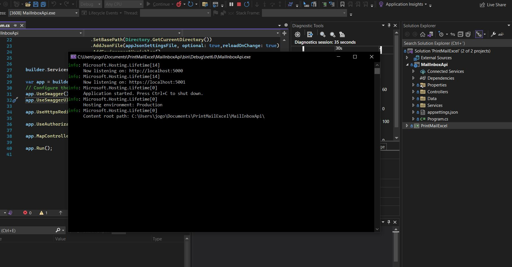
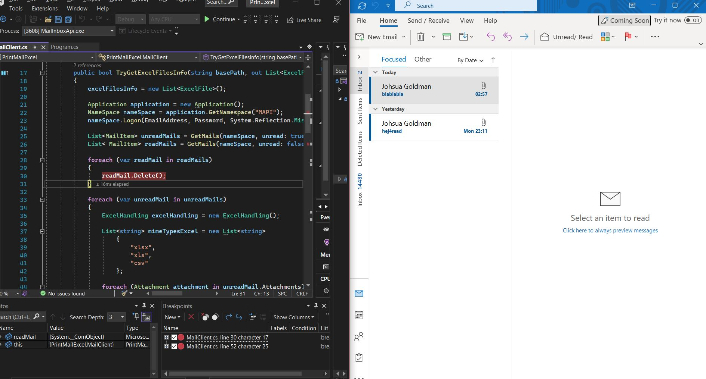
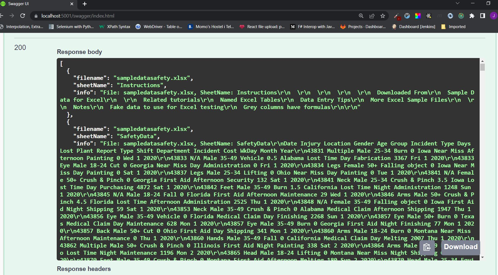
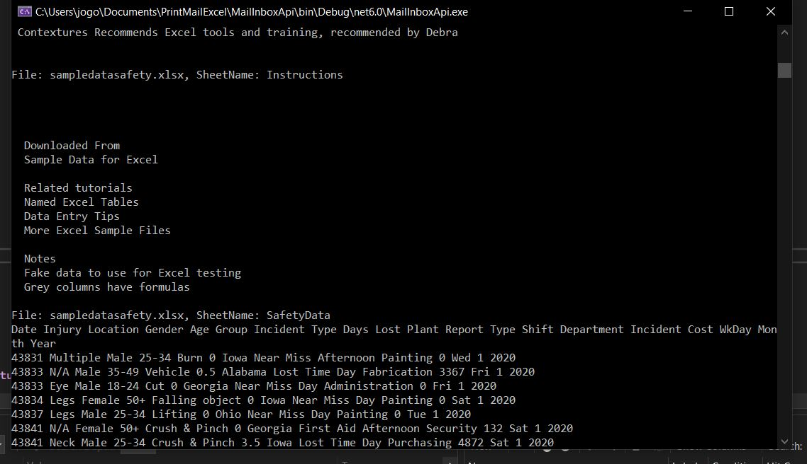

# PrintMailExcel
The [PrintMailExcel.csproj](https://github.com/joshuagoldman/PrintMailExcel/blob/main/PrintMailExcel.csproj) with its associated classes enables for logging on to an outlook account (using email address and password), and subsequently to perform the following procedure:

- Search through mail inbox
- Find messages that are already viewed and delete them
- Collect messages in the inbox folder that have not yet been viewed, and filter out messages that do not contain attached excel files (.xlsx, .xls, .cs, etc.).
- For each attached excel file found amongst the unread email messages, print row by row.

## Demonstration through Web API
Through the [MailInboxApi](https://github.com/joshuagoldman/PrintMailExcel/tree/main/MailInboxApi) c# project, the functionality of fetching and printing the inbox excel files info can be tested out. Demonstrated below is a possible scenario in which the mentioned procedure is performed.

First, the web API application is started on the local machine

The application can be accessed through https://localhost:5001, as seen on the image above. In a next step, the url https://localhost:5001/Swagger/index.html is opened up on the browser of choice (Chrome, Firefox, etc.).

As seen above, the Swagger web GUI is then displayed, which is created at web application startup, providing an overview over the various API calls. Moreover, the API calls can be tested out through Swagger. Here, the only avaiable API request call is the "/ExcelFiles" POST, which is also the one of interest.

The image here displays how the "/ExcelFiles" POST request is executed through Swagger, with the email address **joshuapaulgoldman1994@outlook.com** and password as the request body.

Now, looking at the mail inbox of this email address see image below, there are 

- Two already viewed messages, one of which contains an attached excel file. These should be removed
- 2 unread messages, both of which contain a attached excel file. Here it is desirable to fetch and print each cpmtemt of each excel file, respectively.

Then, the API request is executed.

As expected, the two unread messages are deleted, as can be seen on the image below of the [MailClient.cs](https://github.com/joshuagoldman/PrintMailExcel/blob/main/MailClient.cs) which is part of the [PrintMailExcel.csproj](https://github.com/joshuagoldman/PrintMailExcel/blob/main/PrintMailExcel.csproj) project.

Moreover, with the two remaining messages, the excel content is collected, see image below, or at [MailClient.cs](https://github.com/joshuagoldman/PrintMailExcel/blob/main/MailClient.cs).

Finally, as the requesst finishes, the result can be seen on Swagger:

Or alternatively on the console output:

